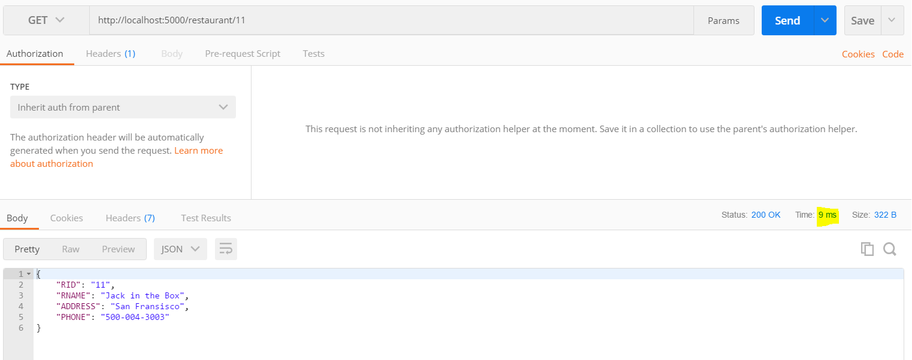

# ZapposRestAPI

### Technologies used
| Application   | Version       |       
| ------------- |:-------------:|
| Node.js       | 8.9.1         |
| npm           | 5.5.1         |
| MySQL         | 5.7           |
| Redis         | 3.0.6        |

### Steps to run

1. Install Node.js, MySQL and Redis.
2. Run **git clone https://github.com/vinaycalastry/ZapposRestAPI.git** to get the code from GitHub.
3. Run the MySQLDB.sql script file provided for the tables to be created.
4. Edit the **.env** file provided with correct values for MySQL DB and Redis
5. Navigate to the ZapposRestAPI folder(where package.json is located) and run **npm install**. This will install all the require dependencies for Node.js
6. Run **npm test** to run the unit-test cases.
7. Run **npm start** inorder to start the webserver.

### Rest API Endpoints

**BaseURL**: http://localhost:5000

*Body type for POST*: application/json

_Please check included **Endpoints_and_testcases.xlsx** file for more info_

| Endpoint        | HTTP Verb | Purpose                                                                 | Example                             | JSON Request                                                                                           | JSON Response                                                                                                           |
|-----------------|-----------|-------------------------------------------------------------------------|-------------------------------------|--------------------------------------------------------------------------------------------------------|-------------------------------------------------------------------------------------------------------------------------|
| /               | GET       | Base URL to check if webservice is up                                   | http://localhost:5000               |                                                                                                        | {"Message":"Welcome to the Restaurant API V1.0."}                                                                       |
| /restaurant     | POST      | Add a new restaurant to the Database and generate a Restaurant ID       | http://localhost:5000/restaurant    | {"RNAME":"Jack in the Box","ADDRESS":"San Fransisco","PHONE":"500-004-3003"}                           | {"Message":"Restaurant with RID: 22 added to Table DB.","RID":22}                                                       |
| /restaurant/:ID | GET       | Get a Restaurant details using its Restaurant ID                        | http://localhost:5000/restaurant/22 |                                                                                                        | {"RID":"22","RNAME":"Jack in the Box","ADDRESS":"San Fransisco","PHONE":"500-004-3003"}                                 |
| /menu           | POST      | Add a new menu to a restaurant and generate a Menu ID                   | http://localhost:5000/menu          | {"MNAME":"Dinner","MDETAILS":"All dishes relating to dinner before 9:00PM are stored here","RID":"22"} | {"Message":"Menus with ID: 26 of Restaurant with RID: 22 added to Menus Table in DB.","MID":26,"RID":"22"}              |
| /menu/:ID       | GET       | Get menus of a restaurant using its Menu ID                             | http://localhost:5000/menu/26       |                                                                                                        | {"MID":"26","MNAME":"Dinner","MDETAILS":"All dishes relating to dinner before 9:00PM are stored here","RID":"22"}       |
| /menuItem       | POST      | Add a new menuitem to a menu of a restaurant and generate a MenuItem ID | http://localhost:5000/menuItem      | {"MITEMNAME":"PrimeRib","MITEMDETAILS":"Burger","MITEMPRICE":4.95,"MID":"1","RID":"1"}                 | {"Message":"MenuItem with ID: 6 of Restaurant with RID: 22 added to Menus Table in DB.","MIID":6,"MID":"26","RID":"22"} |
| /menuItem/:ID   | GET       | Get menu items in a menu of a restaurant using its MenuItem ID          | http://localhost:5000/menuItem/6    |                                                                                                        | {"MIID":"6","MITEMNAME":"PrimeRib","MITEMDETAILS":"Burger","MITEMPRICE":"4.95","MID":"26","RID":"22"}                   |
| /menuItem/:ID   | DELETE    | Delete menu items in a menu of a restaurant using its MenuItem ID       | http://localhost:5000/menuItem/6    |                                                                                                        | {"Message":"MenuItem with ID:6 deleted from DB"}                                                                        |
| /menu/:ID       | DELETE    | Delete Menus of a restaurant using its Menu ID                          | http://localhost:5000/menu/26       |                                                                                                        | {"Message":"Menu with ID:26 deleted from DB"}                                                                           |
| /restaurant/:ID | DELETE    | Delete a Restaurant and its details using its Restaurant  ID            | http://localhost:5000/restaurant/22 |                                                                                                        | {"Message":"Restaurant with RID:22 deleted from DB","RID":"22"}                                                         |

### Unit Test Results

PS D:\WorkSpaces\Projects\Zappos\RestaurantAPI> npm test

> restaurantapi@1.0.0 test D:\WorkSpaces\Projects\Zappos\RestaurantAPI
> mocha --timeout 10000

Running on: 5000 port
  /GET BaseRoute
    √ It should test if webservice is up

  /GET /Restaurant/:ID
    √ It should test if webservice sends No Rows found

  /POST /Restaurant
    √ It should test if Restaurant details are added to DB

  /GET /Restaurant/:ID
    √ It should test if Restaurant details are retrieved from DB

  /GET /Menu/:ID
    √ It should test if webservice sends No Rows found for Menus in DB

  /POST /Menu
    √ It should test if Menu is properly added to DB

  /GET /Menu/:ID
    √ It should get the previously added menu from menus table in DB

  /GET /menuItem/:ID
    √ It should test if webservice sends No Rows found for MenuItems GET request

  /POST /menuItem
    √ It should test if Menu is properly added to DB

  /GET /menuItem/:ID
    √ It should get the previously added menuitem from menuitems table in DB

  /DELETE /menuItem/:ID
    √ It should delete the previously added menuitem from menuitems table in DB

  /DELETE /menu/:ID
    √ It should delete the previously added menu from menus table in DB

  /DELETE /restaurant/:ID
    √ It should test if Restaurant details are deleted from Restaurant Table in DB

  13 passing (223ms)

  ### Use of Redis as a cache

  Fetching from DB takes: *34ms*
  

  Fetching from a locally hosted cache takes: *9ms*
 

 ### Work in Progress
 1. Fetch all restaurants instead of with ID.
 2. Fetch all menuitems and insert multiple menus and menuitems at a time.